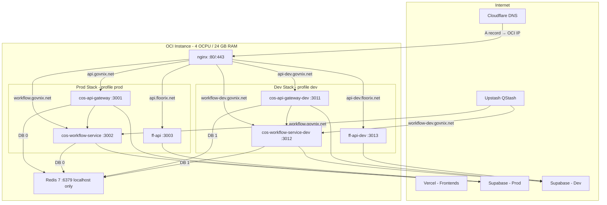

# Design Document: OCI Infrastructure Migration

## Overview

This document describes the technical design for migrating DotEvolve's three backend services from Heroku to a self-managed Oracle Cloud Infrastructure (OCI) instance, along with the associated domain rebranding (Govnix → Govnix on `govnix.net`, Foot Factory → Floorix on `floorix.net`), environment strategy, self-hosted Redis, CI/CD automation, and all downstream configuration updates.

The migration is a **lift-and-containerise** operation: existing Node.js services are wrapped in Docker images and orchestrated via Docker Compose on a single OCI instance. No application logic changes are required. The design covers infrastructure provisioning, container orchestration, reverse proxy configuration, TLS, DNS, CI/CD pipelines, Supabase environment separation, and the app registry update.

### Goals

- Eliminate Heroku costs by moving all three backend services to OCI.
- Establish a clean prod/dev environment split on the same instance using Docker Compose profiles.
- Automate deployments via GitHub Actions with CalVer tagging and health-check gating.
- Update all domain references to reflect the Govnix and Floorix rebranding.
- Separate production and development Supabase projects for data isolation.

### Non-Goals

- Migrating frontend SPAs off Vercel (they stay on Vercel).
- Migrating `dot-portal-api` off Vercel.
- Changing any application-level business logic in the three backend services.
- Introducing Kubernetes or any orchestrator beyond Docker Compose.

---

## Architecture

### High-Level Topology



### Branching and Deployment Flow

```mermaid
gitGraph
    commit id: "feature work"
    branch feature/my-feature
    checkout feature/my-feature
    commit id: "implement"
    checkout dev
    merge feature/my-feature id: "PR merge → dev deploy"
    checkout main
    merge dev id: "release → prod deploy + CalVer tag"
```

- `feature/*` → PR into `dev` → triggers dev deploy to OCI dev stack
- `dev` → PR into `master` → triggers prod deploy to OCI prod stack + CalVer auto-tag
- Direct pushes to `master` reserved for hotfixes only

### Environment Isolation Summary

| Concern                | Prod                              | Dev                                       |
| ---------------------- | --------------------------------- | ----------------------------------------- |
| Docker Compose profile | `prod`                            | `dev`                                     |
| Ports                  | 3001, 3002, 3003                  | 3011, 3012, 3013                          |
| Redis DB               | 0                                 | 1                                         |
| Supabase project       | New dedicated prod project        | Existing project                          |
| QStash project         | Prod Upstash project              | Dev Upstash project                       |
| Hostnames              | `*.govnix.net`, `api.floorix.net` | `*-dev.govnix.net`, `api-dev.floorix.net` |
| Env file               | `.env.prod`                       | `.env.dev`                                |

---

## Components and Interfaces

### 1. OCI Instance

**Responsibilities**: Host all Docker containers, nginx, Redis, and TLS certificates.

**Setup requirements**:

- Ubuntu 22.04 LTS (or Oracle Linux 8)
- Docker Engine (latest stable) + Docker Compose v2 plugin
- Certbot + `certbot-dns-cloudflare` plugin
- OCI Security List / iptables: allow 80/tcp, 443/tcp inbound; block 6379 from public
- Deployment directory: `/opt/dotevolve/`
- Dedicated `deploy` OS user with Docker socket access and write access to `/opt/dotevolve/repos/`

### 2. Docker Compose Orchestration

**File**: `/opt/dotevolve/docker-compose.yml`

Single compose file with three profiles: `prod`, `dev`, `all`. Services:

| Service                    | Profile | Port             | Env file    | Redis DB |
| -------------------------- | ------- | ---------------- | ----------- | -------- |
| `cos-api-gateway`          | prod    | 3001             | `.env.prod` | 0        |
| `cos-workflow-service`     | prod    | 3002             | `.env.prod` | 0        |
| `ff-api`                   | prod    | 3003             | `.env.prod` | —        |
| `cos-api-gateway-dev`      | dev     | 3011             | `.env.dev`  | 1        |
| `cos-workflow-service-dev` | dev     | 3012             | `.env.dev`  | 1        |
| `ff-api-dev`               | dev     | 3013             | `.env.dev`  | —        |
| `redis`                    | all     | 6379 (localhost) | —           | shared   |
| `nginx`                    | all     | 80, 443          | —           | —        |

All services use `restart: always`. The `nginx` service depends on all six application containers.

### 3. Dockerfiles

All three services use the same base pattern with one CMD difference:

**`cos-api-gateway` and `cos-workflow-service`**:

```dockerfile
FROM node:24-alpine
WORKDIR /app
COPY package*.json ./
RUN npm ci --omit=dev
COPY . .
RUN npm run build
EXPOSE 3000
CMD ["node", "api/index.js"]
```

**`ff-api`**:

```dockerfile
FROM node:24-alpine
WORKDIR /app
COPY package*.json ./
RUN npm ci --omit=dev
COPY . .
RUN npm run build
EXPOSE 3000
CMD ["node", "dist/server.js"]
```

**`.dockerignore`** (all three repos):

```
node_modules
.env*
.git
dist
*.log
```

### 4. Nginx Reverse Proxy

**Location**: `/opt/dotevolve/nginx/`

nginx runs as a Docker container, mounting config files read-only. It handles:

- TLS termination using Let's Encrypt wildcard certs
- HTTP → HTTPS 301 redirects
- Hostname-based upstream routing
- Security headers on all responses
- Proxy header forwarding (`Host`, `X-Real-IP`, `X-Forwarded-For`, `X-Forwarded-Proto`)

Config file layout:

```
nginx/
├── nginx.conf              # Main config, includes conf.d/
└── conf.d/
    ├── govnix-prod.conf    # api.govnix.net, workflow.govnix.net
    ├── govnix-dev.conf     # api-dev.govnix.net, workflow-dev.govnix.net
    ├── floorix-prod.conf   # api.floorix.net
    └── floorix-dev.conf    # api-dev.floorix.net
```

Timeout configuration:

- `cos-api-gateway` upstreams: `proxy_read_timeout 120s`
- `cos-workflow-service` upstreams: `proxy_read_timeout 300s` (PDF/AI processing)
- `ff-api` upstreams: default (60s)

### 5. TLS / Certbot

Wildcard certificates issued via Cloudflare DNS-01 challenge:

```bash
# govnix.net wildcard
sudo certbot certonly \
  --dns-cloudflare \
  --dns-cloudflare-credentials ~/.secrets/cloudflare.ini \
  -d govnix.net -d "*.govnix.net"

# floorix.net wildcard
sudo certbot certonly \
  --dns-cloudflare \
  --dns-cloudflare-credentials ~/.secrets/cloudflare.ini \
  -d floorix.net -d "*.floorix.net"
```

Credentials file at `~/.secrets/cloudflare.ini` with `chmod 600`. Auto-renewal via `certbot renew` in a systemd timer or cron (runs twice daily, renews when < 30 days remaining). Post-renewal hook reloads nginx: `docker compose exec nginx nginx -s reload`.

### 6. Self-Hosted Redis

Single Redis 7 container shared by both stacks, isolated by DB index:

- DB 0 → prod services
- DB 1 → dev services
- Bound to `127.0.0.1:6379` only (never publicly exposed)
- AOF persistence via named volume `redis_data`
- `maxmemory 2gb`, `maxmemory-policy allkeys-lru`

`dot-portal-api`'s Upstash Redis connection (billing dedup, portal caching) is **not** migrated — it remains on Upstash.

### 7. GitHub Actions CI/CD

One `deploy.yml` workflow per service repo. The workflow is parameterised by branch to determine prod vs dev target.

**Workflow triggers**:

- `push` to `master` → prod deploy + CalVer tag
- `push` to `dev` → dev deploy

**Required repository secrets**:

- `OCI_HOST` — OCI instance public IP
- `OCI_USER` — deploy SSH username (e.g. `deploy`)
- `OCI_SSH_KEY` — private SSH key (RSA or Ed25519)

**Prod deploy job steps**:

1. Checkout code
2. SSH into OCI instance
3. `cd /opt/dotevolve/repos/{service} && git pull origin master`
4. `docker compose build {service}`
5. If build fails → exit non-zero (running container preserved)
6. `docker compose --profile prod up -d {service}`
7. Health check: `curl -f https://{prod-hostname}/health` (retry 3×, 10s apart)
8. If health check fails → exit non-zero
9. Compute and push CalVer tag (see §CalVer below)

**Dev deploy job steps** (same as prod, steps 1–8, targeting dev service and dev hostname; no CalVer tag).

**CalVer tag computation** (bash, runs in the Actions runner after successful prod deploy):

```bash
YEAR=$(date -u +%Y)
MONTH=$(date -u +%m)
# Find highest existing patch for this YYYY.MM
LATEST=$(git tag -l "${YEAR}.${MONTH}.*" | sort -t. -k3 -n | tail -1)
if [ -z "$LATEST" ]; then
  PATCH="01"
else
  LAST_PATCH=$(echo "$LATEST" | cut -d. -f3)
  PATCH=$(printf "%02d" $((10#$LAST_PATCH + 1)))
fi
TAG="${YEAR}.${MONTH}.${PATCH}"
git tag "$TAG"
git push origin "$TAG"
```

### 8. QStash Target URL Update

Two separate Upstash QStash projects:

| Project | Old target                                   | New target                            |
| ------- | -------------------------------------------- | ------------------------------------- |
| Prod    | `https://cos-workflow.herokuapp.com/...`     | `https://workflow.govnix.net/...`     |
| Dev     | `https://cos-workflow-dev.herokuapp.com/...` | `https://workflow-dev.govnix.net/...` |

Updated via the Upstash console or API. No code changes required.

### 9. Supabase Environment Separation

|                             | Prod                             | Dev                 |
| --------------------------- | -------------------------------- | ------------------- |
| Project                     | New dedicated project            | Existing project    |
| RLS                         | Enabled on all tables from day 0 | Existing state      |
| Key used in backends        | `service_role` only              | `service_role` only |
| Key used in browser clients | `anon` only                      | `anon` only         |

Migration steps for the new prod Supabase project:

1. Create new project in Supabase dashboard
2. Run all existing migrations against the new project (`supabase db push` or manual SQL)
3. Enable RLS on all tables
4. Update `.env.prod` and all Vercel production environment variables with new project URL and keys

### 10. App Registry Update (Supabase `apps` table)

The `dot-portal-api` reads app configuration from the `apps` table in Supabase. Two rows require updates:

| `slug`    | Column          | Old value                                              | New value                                              |
| --------- | --------------- | ------------------------------------------------------ | ------------------------------------------------------ |
| `govnix`  | `base_domain`   | `cos.dotevolve.net`                                    | `govnix.net`                                           |
| `govnix`  | `cors_endpoint` | `https://api.govnix.net/api/v1/internal/cors-origins`  | `https://api.govnix.net/api/v1/internal/cors-origins`  |
| `floorix` | `base_domain`   | `floorix.dotevolve.net`                                | `floorix.net`                                          |
| `floorix` | `cors_endpoint` | `https://api.floorix.net/api/v1/internal/cors-origins` | `https://api.floorix.net/api/v1/internal/cors-origins` |

SQL migration (run against both prod and dev Supabase projects):

```sql
UPDATE apps SET
  base_domain = 'govnix.net',
  cors_endpoint = 'https://api.govnix.net/api/v1/internal/cors-origins'
WHERE slug = 'govnix';

UPDATE apps SET
  base_domain = 'floorix.net',
  cors_endpoint = 'https://api.floorix.net/api/v1/internal/cors-origins'
WHERE slug = 'floorix';
```

After this update, `dot-portal-api`'s `loadAppRegistryFromDb()` will provision tenant subdomains as `{tenantSlug}.govnix.net` and `{tenantSlug}.floorix.net`. The env-var fallback in `loadAppRegistry()` must also be updated in `.env.example` and Vercel environment variables.

### 11. Environment Variable Updates

**`cos-frontend` (Vercel)**:

| Branch   | Variable               | Value                        |
| -------- | ---------------------- | ---------------------------- |
| `master` | `VITE_API_GATEWAY_URL` | `https://api.govnix.net`     |
| `dev`    | `VITE_API_GATEWAY_URL` | `https://api-dev.govnix.net` |

**`dot-portal-api` (Vercel)**:

| Environment | Variable                     | Value                                                      |
| ----------- | ---------------------------- | ---------------------------------------------------------- |
| Production  | `DOT_COS_BASE_DOMAIN`        | `govnix.net`                                               |
| Production  | `FOOT_FACTORY_BASE_DOMAIN`   | `floorix.net`                                              |
| Production  | `DOT_COS_CORS_ENDPOINT`      | `https://api.govnix.net/api/v1/internal/cors-origins`      |
| Production  | `FOOT_FACTORY_CORS_ENDPOINT` | `https://api.floorix.net/api/v1/internal/cors-origins`     |
| Dev         | `DOT_COS_CORS_ENDPOINT`      | `https://api-dev.govnix.net/api/v1/internal/cors-origins`  |
| Dev         | `FOOT_FACTORY_CORS_ENDPOINT` | `https://api-dev.floorix.net/api/v1/internal/cors-origins` |

**`cos-api-gateway` `.env.prod` / `.env.dev`** (on OCI instance):

- `WORKFLOW_SERVICE_URL` → `https://workflow.govnix.net` (prod) / `https://workflow-dev.govnix.net` (dev)
- `SUPABASE_URL` → new prod project URL (prod) / existing dev project URL (dev)
- `SUPABASE_ANON_KEY` → corresponding project anon key
- No Heroku-specific variables

### 12. Vercel Custom Domain Registration

Each Vercel project requires custom domain registration via the Vercel dashboard or CLI:

| Vercel Project        | Prod Domain                | Dev Domain                     |
| --------------------- | -------------------------- | ------------------------------ |
| `cos-frontend`        | `app.govnix.net`           | `app-dev.govnix.net`           |
| `cos-admin-dashboard` | `admin.govnix.net`         | `admin-dev.govnix.net`         |
| `floorix-app`         | `app.floorix.net`          | `app-dev.floorix.net`          |
| `floorix-admin`       | `admin.floorix.net`        | `admin-dev.floorix.net`        |
| `dot-portal`          | `portal.dotevolve.net`     | `portal-dev.dotevolve.net`     |
| `dot-admin`           | `admin.dotevolve.net`      | `admin-dev.dotevolve.net`      |
| `dot-portal-api`      | `portal-api.dotevolve.net` | `portal-api-dev.dotevolve.net` |

### 13. Health Check Endpoints

`cos-api-gateway` already exposes `GET /health` returning `{"service": "api-gateway", "status": "healthy"}`. The response body format needs to be normalised to `{"status": "ok"}` per Requirement 13.1, or the CI/CD health check script can accept the existing format — the design opts to keep the existing format and update the CI/CD check to accept HTTP 200 regardless of body content, avoiding a code change.

`cos-workflow-service` and `ff-api` must each expose `GET /health` returning HTTP 200 with `{"status": "ok"}`. If a required dependency (Redis, database) is unreachable, the endpoint returns HTTP 503 with `{"status": "error", "dependency": "<name>"}`.

### 14. Heroku Decommission Sequence

Decommission is gated on three conditions being met simultaneously:

1. All three OCI prod services respond HTTP 200 on `/health`
2. QStash target URLs updated to OCI hostnames (Req 8)
3. App Registry updated in Supabase (Req 9)

Once all three are confirmed:

1. Scale Heroku dynos to 0 (or delete apps)
2. Remove Heroku DNS entries / custom domains from Heroku dashboard
3. Verify no DNS records still point to `*.herokuapp.com`

---

## Data Models

### `/opt/dotevolve/` Directory Layout

```
/opt/dotevolve/
├── docker-compose.yml
├── .env.prod                   # Production secrets (not in git)
├── .env.dev                    # Dev secrets (not in git)
├── nginx/
│   ├── nginx.conf
│   └── conf.d/
│       ├── govnix-prod.conf
│       ├── govnix-dev.conf
│       ├── floorix-prod.conf
│       └── floorix-dev.conf
├── redis/
│   └── redis.conf              # Optional overrides (maxmemory set via compose cmd)
└── repos/
    ├── govnix-api-gateway/    # git clone of service repo
    ├── govnix-workflow-service/
    └── floorix-api/
```

### Supabase `apps` Table Schema (relevant columns)

```sql
-- Existing schema, no structural changes required
CREATE TABLE apps (
  slug            TEXT PRIMARY KEY,
  name            TEXT NOT NULL,
  base_domain     TEXT NOT NULL,       -- updated: govnix.net / floorix.net
  vercel_project_id TEXT NOT NULL,
  cors_endpoint   TEXT NOT NULL,       -- updated: api.govnix.net / api.floorix.net
  allow_self_signup BOOLEAN DEFAULT true,
  is_active       BOOLEAN DEFAULT true
);
```

### GitHub Actions Workflow Structure

```yaml
# .github/workflows/deploy.yml (per service repo)
name: Deploy
on:
  push:
    branches: [master, dev]

jobs:
  deploy:
    runs-on: ubuntu-latest
    steps:
      - uses: actions/checkout@v4
        with:
          fetch-depth: 0 # needed for tag listing
      - name: Deploy to OCI
        uses: appleboy/ssh-action@v1
        with:
          host: ${{ secrets.OCI_HOST }}
          username: ${{ secrets.OCI_USER }}
          key: ${{ secrets.OCI_SSH_KEY }}
          script: |
            # branch-conditional logic (prod vs dev)
            ...
      - name: Health check
        run: |
          # curl with retry
          ...
      - name: Tag release (master only)
        if: github.ref == 'refs/heads/master'
        run: |
          # CalVer computation and push
          ...
```

### CalVer Tag Format

```
YYYY.MM.XX
│    │   └── zero-padded patch, auto-incremented per month (01, 02, ...)
│    └────── zero-padded month (01–12)
└─────────── four-digit year

Examples: 2026.05.01, 2026.05.02, 2026.06.01
```

---

## Error Handling

### Build Failure (CI/CD)

When `docker compose build` fails, the GitHub Actions step exits non-zero. The subsequent `docker compose up -d` step is skipped (depends on prior step success). The currently running container continues serving traffic from the last successful image. The workflow reports failure and notifies via GitHub's built-in notification system.

### Health Check Failure (CI/CD)

After a successful build and container restart, the health check polls `/health` up to 3 times with 10-second intervals. If all attempts return non-200, the workflow exits non-zero. The container remains running (it was already restarted), but the CalVer tag is not created. The engineer must investigate logs (`docker compose logs -f {service}`) and either roll back or push a fix.

### Rollback Procedure

```bash
# On OCI instance — roll back to a specific CalVer tag
cd /opt/dotevolve/repos/{service}
git fetch --tags
git checkout 2026.05.01          # target tag
docker compose build {service}
docker compose --profile prod up -d {service}
```

### Redis OOM

Redis is configured with `maxmemory 2gb` and `allkeys-lru`. When memory is exhausted, Redis evicts the least-recently-used keys rather than returning errors. Services that depend on cache hits (rate limiting, session caching) will experience cache misses but will not crash. The 24 GB instance RAM provides ample headroom above the 2 GB Redis cap.

### TLS Certificate Expiry

Certbot's auto-renewal runs twice daily. If renewal fails (e.g. Cloudflare API token expired), Let's Encrypt sends expiry warning emails at 20 days and 7 days before expiry. The post-renewal hook (`nginx -s reload`) ensures nginx picks up the new certificate without downtime.

### Nginx Container Restart

If nginx crashes, Docker's `restart: always` policy restarts it within seconds. During the restart window (typically < 5 seconds), all inbound HTTPS connections are refused. This is acceptable for the current traffic volume.

### OCI Instance Reboot

All containers have `restart: always`, so they restart automatically after a reboot. Redis AOF persistence ensures no data loss on restart. The expected downtime during a reboot is the time for Docker to start all containers (typically 30–60 seconds).

### Supabase Project Unavailability

Backend services use the `service_role` key and connect to Supabase over HTTPS. If Supabase is unavailable, services return 503 errors to clients. No local fallback is implemented — this is consistent with the existing Heroku deployment behaviour.

---

## Testing Strategy

This feature is an infrastructure migration with no new application logic. Property-based testing is not applicable — there are no pure functions with input/output behaviour to test across a wide input space. The testing strategy uses smoke tests and integration tests.

### PBT Applicability Assessment

This migration involves:

- Docker Compose YAML configuration
- nginx configuration files
- Dockerfiles
- GitHub Actions YAML
- DNS record creation
- TLS certificate issuance
- SQL `UPDATE` statements
- Environment variable updates

None of these are functions with testable input/output behaviour. PBT is not appropriate. The Correctness Properties section is omitted from this design.

### Smoke Tests (run once after each deployment phase)

These verify that the infrastructure is wired up correctly. Each is a single execution — running them 100 times adds no value.

| Test                         | Command                                          | Expected           |
| ---------------------------- | ------------------------------------------------ | ------------------ |
| Prod API gateway health      | `curl -f https://api.govnix.net/health`          | HTTP 200           |
| Prod workflow service health | `curl -f https://workflow.govnix.net/health`     | HTTP 200           |
| Prod ff-api health           | `curl -f https://api.floorix.net/health`         | HTTP 200           |
| Dev API gateway health       | `curl -f https://api-dev.govnix.net/health`      | HTTP 200           |
| Dev workflow service health  | `curl -f https://workflow-dev.govnix.net/health` | HTTP 200           |
| Dev ff-api health            | `curl -f https://api-dev.floorix.net/health`     | HTTP 200           |
| HTTP → HTTPS redirect        | `curl -I http://api.govnix.net/`                 | HTTP 301           |
| TLS certificate validity     | `curl -v https://api.govnix.net/health`          | No cert error      |
| Redis prod connectivity      | `docker exec redis redis-cli -n 0 ping`          | `PONG`             |
| Redis dev connectivity       | `docker exec redis redis-cli -n 1 ping`          | `PONG`             |
| Redis not publicly exposed   | `nc -zv {OCI_IP} 6379` (from external)           | Connection refused |

### Integration Tests (run after full migration)

These verify end-to-end behaviour across service boundaries.

| Test                             | Steps                                                                                 | Expected                         |
| -------------------------------- | ------------------------------------------------------------------------------------- | -------------------------------- |
| Authenticated API request (prod) | Obtain Supabase JWT → `GET https://api.govnix.net/api/v1/me` with Bearer token        | HTTP 200, user data returned     |
| QStash delivery (prod)           | Trigger a workflow that enqueues a QStash job → check workflow-service logs           | Job received and processed       |
| Tenant subdomain provisioning    | Create a test tenant via `dot-portal-api` → verify CNAME record created in Cloudflare | DNS record exists                |
| App registry warm cache          | Restart `dot-portal-api` → call an endpoint that uses `loadAppRegistry()`             | Returns `govnix.net` base domain |
| Supabase RLS (prod)              | Attempt a direct table query with `anon` key on a protected table                     | RLS policy blocks or restricts   |

### CI/CD Pipeline Tests (automated, per deploy)

These run automatically as part of every GitHub Actions deployment:

1. **Build gate**: `docker compose build` must exit 0 before container restart
2. **Health check gate**: `GET /health` must return HTTP 200 within 30 seconds of container start (3 retries × 10s)
3. **CalVer tag**: Created and pushed only after health check passes on `master` deploys

### Rollback Verification

After any rollback to a CalVer tag:

1. Run the smoke tests above against the affected service
2. Confirm the running image tag matches the target CalVer tag: `docker inspect {service} | grep Image`

### Pre-Decommission Checklist (Heroku)

Before scaling Heroku dynos to zero, verify all of the following:

- [ ] All 6 OCI health check smoke tests pass
- [ ] QStash target URLs updated and a test job delivered successfully
- [ ] App Registry updated in Supabase (both prod and dev)
- [ ] `dot-portal-api` env vars updated in Vercel
- [ ] `cos-frontend` `VITE_API_GATEWAY_URL` updated in Vercel
- [ ] Vercel custom domains registered for all 7 projects
- [ ] DNS A records for all 6 OCI-hosted subdomains verified in Cloudflare
