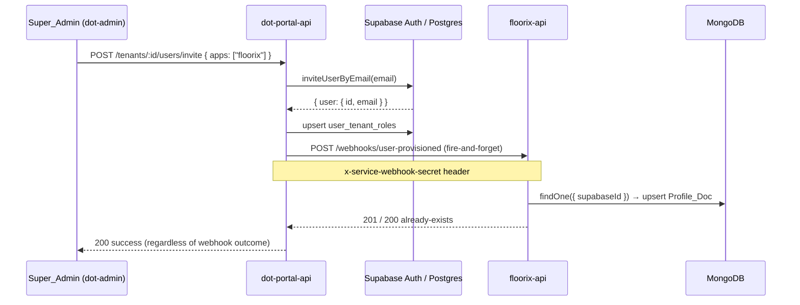

# Design Document — Tenant User Management

## Overview

This feature closes three gaps in the DotEvolve platform's cross-app user management story:

1. **Gap 1 (Backend sync)** — `floorix-api` needs a webhook endpoint so `dot-portal-api` can proactively create a MongoDB `Profile_Doc` whenever a user is granted floorix access. Without this, the profile only materialises lazily on first login, which can cause domain-object FK failures.

2. **Gap 2 (Foot-Factory Admin UI)** — `floorix-admin` needs a "Users" tab on its Tenants page so Super_Admins can view, invite, and revoke floorix users without switching to `dot-admin`.

3. **Gap 3 / Scope correction (Cos Admin Dashboard UI)** — `govnix-admin` must be corrected to show only a read-only user count summary. Any previously implemented write controls (InviteUserModal, UserService, TenantUserManagementSection) must be removed; full user management lives in `dot-admin`.

### Key architectural constraints

- **Supabase is the single source of truth** for identity and roles. `user_tenant_roles (user_id, tenant_id, app_slug, role)` is authoritative.
- **dot-portal-api is the single write gateway** for all tenant/user operations. App-specific dashboards call portal-api; they do not write to Supabase directly.
- **MongoDB in floorix-api is reference-only** — it stores profile data (`supabaseId`, `email`, `name`, `username`, `tenantId`) so domain objects can hold a local FK. No credentials or roles live there.
- The existing `POST /api/v1/webhooks/supabase-user-created` handler in `webhookController.js` is **not modified**.

---

## Architecture

### Data flow — proactive profile sync (Gap 1)



The same flow applies when `grantAppAccess` is called with `appSlug === "floorix"`.

### Component map

```
floorix-api
  Routes/webhookRoutes.js          ← add POST /user-provisioned route
  controllers/webhookController.js ← add handleUserProvisioned export

dot-portal-api
  src/utils/floorixWebhook.ts  ← new: notifyFloorix()
  src/controllers/userController.ts ← modify: inviteUser, grantAppAccess

floorix-admin
  src/lib/portalApi.ts             ← new: portalApiClient Axios instance
  src/components/TenantUsersTab.tsx       ← new
  src/components/FloorixInviteModal.tsx ← new
  src/pages/Tenants.tsx            ← modify: add Users tab

govnix-admin
  src/components/UserSummarySection.tsx   ← new
  src/pages/Tenants.tsx            ← modify: add UserSummarySection, remove old write components
```

---

## Components and Interfaces

### 1. `webhookController.handleUserProvisioned` (floorix-api)

New export alongside the existing `handleUserCreated`. Follows the identical pattern: validate secret header, validate body, idempotent upsert.

```js
// Signature (CommonJS, asyncHandler-wrapped)
exports.handleUserProvisioned = asyncHandler(async (req, res) => { ... });
```

**Request contract:**
- Header: `x-service-webhook-secret: <SERVICE_WEBHOOK_SECRET>`
- Body: `{ userId: string, email: string, tenantId: string }`

**Response contract:**

| Condition | Status | Body |
|-----------|--------|------|
| Bad/missing secret | 401 | `{ status: "error", message: "Unauthorized" }` |
| Missing field | 400 | `{ status: "error", message: "..." }` |
| Profile_Doc created | 201 | `{ status: "ok" }` |
| Profile_Doc already exists | 200 | `{ status: "ok", message: "already exists" }` |

**Idempotency guard:** uses `User.findOne({ supabaseId: userId }).setOptions({ skipTenantFilter: true })` — same pattern as `handleUserCreated`.

---

### 2. `webhookRoutes.js` addition (floorix-api)

```js
// New line alongside existing route
router.post('/user-provisioned', webhookController.handleUserProvisioned);
```

---

### 3. `notifyFloorix` utility (dot-portal-api)

New file: `src/utils/floorixWebhook.ts`

```ts
export async function notifyFloorix(
  userId: string,
  email: string,
  tenantId: string,
): Promise<void>
```

- POSTs to `${process.env.FOOT_FACTORY_API_URL}/api/v1/webhooks/user-provisioned`
- Attaches `x-service-webhook-secret: process.env.SERVICE_WEBHOOK_SECRET`
- Fire-and-forget: wraps the call in `try/catch`, logs errors via `console.error`, never re-throws
- Uses the native `fetch` API (Node 18+) — no new dependency needed

---

### 4. `userController` modifications (dot-portal-api)

**`inviteUser`** — after the successful `upsert` of role records and before the `res.status(200)` return:

```ts
if (apps.includes("floorix")) {
  await notifyFloorix(invitedUserId, email, tenantId);
}
```

**`grantAppAccess`** — after the successful `upsert` and `buildAndWrite` call:

```ts
if (appSlug === "floorix") {
  const { data: targetUser } = await supabaseAdmin.auth.admin.getUserById(userId);
  if (targetUser?.user?.email) {
    await notifyFloorix(userId, targetUser.user.email, tenantId);
  }
}
```

The `notifyFloorix` call is always fire-and-forget; errors are swallowed inside the utility.

---

### 5. `portalApiClient` (floorix-admin)

New file: `src/lib/portalApi.ts`

Mirrors `src/lib/axios.ts` exactly, with two differences:
- `baseURL` = `import.meta.env.VITE_PORTAL_API_URL ?? "https://portal-api.dotevolve.net"`
- The 401 refresh path reuses `apiClient` (the existing floorix-api Axios instance) to call `/auth/refresh`, then retries the original portal-api request with the new token

```ts
import axios from "axios";
import { Sentry } from "@dotevolve/error-utils/react";
import apiClient from "./axios"; // for token refresh

const PORTAL_API_URL =
  import.meta.env.VITE_PORTAL_API_URL ?? "https://portal-api.dotevolve.net";

export const portalApiClient = axios.create({
  baseURL: PORTAL_API_URL,
  headers: { "Content-Type": "application/json" },
});
// request interceptor: attach JWT from localStorage
// response interceptor: 5xx → Sentry, 401 → refresh via apiClient → retry
```

---

### 6. `TenantUsersTab` component (floorix-admin)

New file: `src/components/TenantUsersTab.tsx`

```ts
interface TenantUsersTabProps {
  tenantId: string;
}
```

**Internal state:**
- `users: UserRow[]` — filtered to `app_slug === "floorix"`
- `loading: boolean`
- `error: string | null`
- `revokingId: string | null`
- `showInviteModal: boolean`

**`UserRow` type:**
```ts
interface UserRow {
  userId: string;
  email?: string;   // resolved from roles or a future enrichment endpoint
  role: string;     // the role for app_slug === "floorix"
}
```

> Note: `GET /api/v1/tenants/:tenantId/users` currently returns `{ userId, roles[] }` without email. The component will display `userId` as a fallback if email is absent, consistent with the existing `UserTable` in `dot-admin` which resolves email separately via `useUsers` hook. If the portal-api response is extended to include email in a future iteration, the component will pick it up automatically.

**API calls (all via `portalApiClient`):**
- Fetch: `GET /api/v1/tenants/:tenantId/users`
- Invite: `POST /api/v1/tenants/:tenantId/users/invite`
- Revoke: `DELETE /api/v1/tenants/:tenantId/users/:userId/apps/floorix`

**Filtering logic:**
```ts
const floorixUsers = (data.users ?? [])
  .filter(u => u.roles.some(r => r.appSlug === "floorix"))
  .map(u => ({
    userId: u.userId,
    role: u.roles.find(r => r.appSlug === "floorix")!.role,
  }));
```

**Optimistic revoke:** on successful DELETE, remove the user from local state without re-fetching.

---

### 7. `FloorixInviteModal` component (floorix-admin)

New file: `src/components/FloorixInviteModal.tsx`

```ts
interface FloorixInviteModalProps {
  tenantId: string;
  onClose: () => void;
  onSuccess: () => void;
}
```

Modelled on `dot-admin/src/components/InviteUserModal.tsx` with one key difference: the `floorix` app is pre-selected and the checkbox is `disabled` (non-removable). The submitted body always includes `apps: ["floorix"]`.

Fields: email (required, type=email), role selector (`user` default, `tenant-admin` option).

---

### 8. `Tenants.tsx` modification (floorix-admin)

The existing page uses a flat table with a slide-out `TenantConfigPanel`. The "Users" tab will be added as a new tab inside `TenantConfigPanel` (or as a second panel trigger), keeping the existing configure/edit/suspend/delete actions intact.

Concretely: add a "Users" button in the Actions column alongside "Configure". When clicked, open a new `TenantUsersPanel` (or extend `TenantConfigPanel` with a tab switcher) that renders `<TenantUsersTab tenantId={tenant._id} />`.

The simplest approach that avoids restructuring the existing panel: add a second slide-out panel state `usersPanelTenant` and render a new `TenantUsersPanel` component that wraps `TenantUsersTab`. This keeps the existing `TenantConfigPanel` untouched.

---

### 9. `UserSummarySection` component (govnix-admin)

New file: `src/components/UserSummarySection.tsx`

```ts
interface UserSummarySectionProps {
  tenantId: string;
}
```

**Internal state:** `count: number | null`, `loading: boolean`, `error: string | null`

**API call:** `GET /api/v1/tenants/:tenantId/users` via `adminApi` (existing Axios instance in `src/lib/adminApi.ts` — same-origin, attaches Supabase JWT via `supabase.auth.getSession()`).

**Count logic:**
```ts
const count = (data.users ?? [])
  .filter(u => u.roles.some((r: { appSlug: string }) => r.appSlug === "govnix"))
  .length;
```

**Rendered output:**
- Loading: spinner
- Error: inline error message (no count)
- Success: `"X users with govnix access"` + `"Manage Users in Dot Admin"` link (`href="https://admin.dotevolve.net"`, `target="_blank"`, `rel="noopener noreferrer"`)
- No write controls of any kind

---

### 10. `Tenants.tsx` modification (govnix-admin)

In the existing expanded row (the `{isExpanded && ...}` block), after the `<AppAssignmentsSection tenantId={tenant.id} />` call, add:

```tsx
<hr className="my-5 border-slate-200" />
<UserSummarySection tenantId={tenant.id} />
```

Remove any imports/usages of `UserService`, `InviteUserModal`, or `TenantUserManagementSection` if they exist in the file.

---

## Data Models

### MongoDB `User` document (floorix-api) — unchanged schema

Fields written by `handleUserProvisioned`:

| Field | Value |
|-------|-------|
| `supabaseId` | `userId` from webhook body |
| `email` | `email` from webhook body (lowercased by schema) |
| `name` | `email` (same as existing `handleUserCreated` pattern) |
| `username` | `email.toLowerCase()` |
| `tenantId` | `tenantId` from webhook body |

The `role` field defaults to `"user"` (schema default). No other fields are set.

### Supabase `user_tenant_roles` — unchanged

`(user_id, tenant_id, app_slug, role)` — written by portal-api, read by portal-api. Not touched by this feature.

### Portal-API response shape for `GET /api/v1/tenants/:tenantId/users`

```ts
{
  status: "success",
  data: {
    users: Array<{
      userId: string;
      roles: Array<{ appSlug: string; role: string }>;
    }>
  }
}
```

This is the existing shape from `listTenantUsers` in `userController.ts`. No changes needed.

---

## Correctness Properties

*A property is a characteristic or behavior that should hold true across all valid executions of a system — essentially, a formal statement about what the system should do. Properties serve as the bridge between human-readable specifications and machine-verifiable correctness guarantees.*

### Property 1: Webhook secret rejection

*For any* string value of the `x-service-webhook-secret` header that is not equal to `SERVICE_WEBHOOK_SECRET` (including absent/empty), the `handleUserProvisioned` handler SHALL return HTTP 401 and the MongoDB Profile_Doc collection SHALL be unchanged.

**Validates: Requirements 1.2, 1.3, 6.1**

---

### Property 2: Missing-field rejection

*For any* authenticated webhook request whose body is missing at least one of `userId`, `email`, or `tenantId`, the `handleUserProvisioned` handler SHALL return HTTP 400 and the MongoDB Profile_Doc collection SHALL be unchanged.

**Validates: Requirements 1.5**

---

### Property 3: Profile_Doc creation correctness

*For any* valid triple `(userId, email, tenantId)` where no Profile_Doc with `supabaseId === userId` exists, a successful call to `handleUserProvisioned` SHALL create exactly one Profile_Doc with `supabaseId === userId`, `email === email.toLowerCase()`, `name === email`, `username === email.toLowerCase()`, and `tenantId === tenantId`.

**Validates: Requirements 1.6, 1.8**

---

### Property 4: Webhook idempotency

*For any* valid webhook payload `{ userId, email, tenantId }`, calling `handleUserProvisioned` twice SHALL produce the same Profile_Doc state as calling it once. The second call SHALL return HTTP 200 with `message: "already exists"`, and the count of Profile_Docs with `supabaseId === userId` SHALL equal 1.

**Validates: Requirements 1.7**

---

### Property 5: notifyFloorix fire-and-forget

*For any* error thrown or rejection returned by the outgoing HTTP call inside `notifyFloorix`, the function SHALL catch the error, log it, and resolve without throwing. The caller (`inviteUser` or `grantAppAccess`) SHALL complete successfully regardless of the webhook outcome.

**Validates: Requirements 2.4**

---

### Property 6: Foot-factory webhook triggered on invite

*For any* `inviteUser` call where the `apps` array contains `"floorix"`, `notifyFloorix` SHALL be called exactly once with the invited user's `userId`, `email`, and the request's `tenantId`. For any `inviteUser` call where `apps` does not contain `"floorix"`, `notifyFloorix` SHALL NOT be called.

**Validates: Requirements 2.1, 2.6**

---

### Property 7: Foot-factory webhook triggered on grant

*For any* `grantAppAccess` call where `appSlug === "floorix"`, `notifyFloorix` SHALL be called exactly once with the target user's `userId`, resolved `email`, and `tenantId`. For any `grantAppAccess` call where `appSlug !== "floorix"`, `notifyFloorix` SHALL NOT be called.

**Validates: Requirements 2.2, 2.6**

---

### Property 8: portalApiClient JWT attachment

*For any* value of `auth_token` stored in `localStorage`, every HTTP request made via `portalApiClient` SHALL include an `Authorization: Bearer <auth_token>` header.

**Validates: Requirements 4.2, 6.3**

---

### Property 9: TenantUsersTab floorix filter invariant

*For any* user list returned by `GET /api/v1/tenants/:tenantId/users`, the set of users rendered by `TenantUsersTab` SHALL be a subset of the API response, and every rendered user SHALL have at least one role entry with `appSlug === "floorix"`.

**Validates: Requirements 3.4, 3.5**

---

### Property 10: Optimistic revoke removes user from view

*For any* user currently displayed in `TenantUsersTab`, after a successful `DELETE .../apps/floorix` response for that user, the user SHALL NOT appear in the rendered list.

**Validates: Requirements 3.16**

---

### Property 11: Invite always includes floorix app

*For any* valid `(email, role)` pair submitted via `FloorixInviteModal`, the POST body sent to `POST /api/v1/tenants/:tenantId/users/invite` SHALL always include `apps: ["floorix"]`.

**Validates: Requirements 3.11**

---

### Property 12: UserSummarySection govnix count invariant

*For any* user list returned by `GET /api/v1/tenants/:tenantId/users`, the count displayed by `UserSummarySection` SHALL equal the number of users in the response whose `roles` array contains at least one entry with `appSlug === "govnix"`.

**Validates: Requirements 5.4**

---

## Error Handling

### floorix-api — `handleUserProvisioned`

| Error | Handling |
|-------|----------|
| Wrong/missing `x-service-webhook-secret` | `throw new AppError('Unauthorized', 401)` — same as `handleUserCreated` |
| Missing `userId`, `email`, or `tenantId` | `throw new AppError('Invalid payload: missing ...', 400)` |
| MongoDB write failure | Propagated to `asyncHandler` → global error handler returns 500 |

### dot-portal-api — `notifyFloorix`

All errors (network, non-2xx response, timeout) are caught inside the utility and logged with `console.error`. The function always resolves. This ensures the original `inviteUser`/`grantAppAccess` response is never blocked or failed by a downstream webhook issue.

### floorix-admin — `TenantUsersTab`

| Error | Handling |
|-------|----------|
| Fetch error (any status) | Set `error` state, render inline error banner + Retry button |
| 401 / 403 from portal-api | `portalApiClient` interceptor handles 401 (refresh + retry); 403 surfaces as an inline error message |
| Revoke error | Set `actionError` state, render inline error; leave list unchanged |
| Invite error | `FloorixInviteModal` sets its own `error` state, renders inline |
| 5xx | Captured to Sentry by `portalApiClient` response interceptor |

### govnix-admin — `UserSummarySection`

| Error | Handling |
|-------|----------|
| Fetch error (any status) | Set `error` state, render inline error message; do not display count |
| 401 / 403 | Inline error message indicating action is not authorised |

---

## Testing Strategy

### Dual testing approach

Unit/example tests cover specific interactions, edge cases, and error states. Property-based tests (via **fast-check**, already in both React projects' dev dependencies) verify universal invariants across generated inputs.

---

### floorix-api

**Unit tests** (Jest, CommonJS):

- `handleUserProvisioned` — example: valid payload creates Profile_Doc with correct fields
- `handleUserProvisioned` — example: missing `userId` returns 400
- `handleUserProvisioned` — example: wrong secret returns 401
- `handleUserProvisioned` — example: duplicate call returns 200 "already exists"
- Route registration smoke test: `POST /api/v1/webhooks/user-provisioned` is not 404

**Property tests** (fast-check):

- **Property 1** — `fc.string()` for secret header value; assert 401 for any value ≠ `SERVICE_WEBHOOK_SECRET`
- **Property 2** — `fc.record({ userId: fc.option(fc.uuid()), email: fc.option(fc.emailAddress()), tenantId: fc.option(fc.uuid()) })` with at least one field absent; assert 400 and no new doc
- **Property 3** — `fc.record({ userId: fc.uuid(), email: fc.emailAddress(), tenantId: fc.uuid() })`; assert created doc fields match
- **Property 4** — same generator as Property 3; call twice, assert count === 1 and second response is 200

Tag format: `// Feature: tenant-user-management, Property N: <property_text>`

---

### dot-portal-api

**Unit tests** (Jest/Vitest, TypeScript):

- `notifyFloorix` — example: successful call sends POST with correct headers and body
- `notifyFloorix` — example: network error is caught and does not throw
- `inviteUser` — example: `apps: ["floorix"]` triggers `notifyFloorix`
- `inviteUser` — example: `apps: ["govnix"]` does NOT trigger `notifyFloorix`
- `grantAppAccess` — example: `appSlug === "floorix"` triggers `notifyFloorix`
- `grantAppAccess` — example: `appSlug === "govnix"` does NOT trigger `notifyFloorix`

**Property tests** (fast-check):

- **Property 5** — `fc.anything()` as the error thrown by fetch mock; assert `notifyFloorix` resolves
- **Property 6** — `fc.array(fc.string())` for `apps`; assert `notifyFloorix` called iff `apps.includes("floorix")`
- **Property 7** — `fc.string()` for `appSlug`; assert `notifyFloorix` called iff `appSlug === "floorix"`

Minimum 100 iterations per property test.

---

### floorix-admin

**Unit tests** (Vitest + React Testing Library):

- `TenantUsersTab` — loading spinner shown while fetch pending
- `TenantUsersTab` — empty state shown when no floorix users
- `TenantUsersTab` — error banner + Retry button shown on fetch failure
- `TenantUsersTab` — Retry button triggers re-fetch
- `TenantUsersTab` — Revoke button disabled during in-flight request
- `TenantUsersTab` — error shown on revoke failure, list unchanged
- `FloorixInviteModal` — floorix checkbox is checked and disabled
- `FloorixInviteModal` — inline error shown on invite failure
- `portalApiClient` — 5xx response triggers Sentry.captureException
- `portalApiClient` — 401 triggers refresh via apiClient then retries
- `portalApiClient` — failed refresh redirects to /login

**Property tests** (fast-check):

- **Property 8** — `fc.string()` for `auth_token`; assert every request has `Authorization: Bearer <token>`
- **Property 9** — `fc.array(fc.record({ userId: fc.uuid(), roles: fc.array(...) }))` for API response; assert rendered users are a subset with floorix role
- **Property 10** — generate a list of users, render, revoke one, assert that user is absent from rendered list
- **Property 11** — `fc.emailAddress()` × `fc.constantFrom("user", "tenant-admin")`; assert POST body always contains `apps: ["floorix"]`

Minimum 100 iterations per property test.

---

### govnix-admin

**Unit tests** (Vitest + React Testing Library):

- `UserSummarySection` — loading indicator shown while fetch pending
- `UserSummarySection` — error message shown on fetch failure, no count displayed
- `UserSummarySection` — "Manage Users in Dot Admin" link has correct href and `target="_blank"`
- `UserSummarySection` — no invite/deactivate buttons rendered
- `UserSummarySection` — component unmounts when tenant row collapses (state released)
- `Tenants.tsx` — `UserSummarySection` rendered below `AppAssignmentsSection` in expanded row

**Property tests** (fast-check):

- **Property 12** — `fc.array(fc.record({ userId: fc.uuid(), roles: fc.array(fc.record({ appSlug: fc.string(), role: fc.string() })) }))` for API response; assert displayed count equals filtered count

Minimum 100 iterations per property test.
